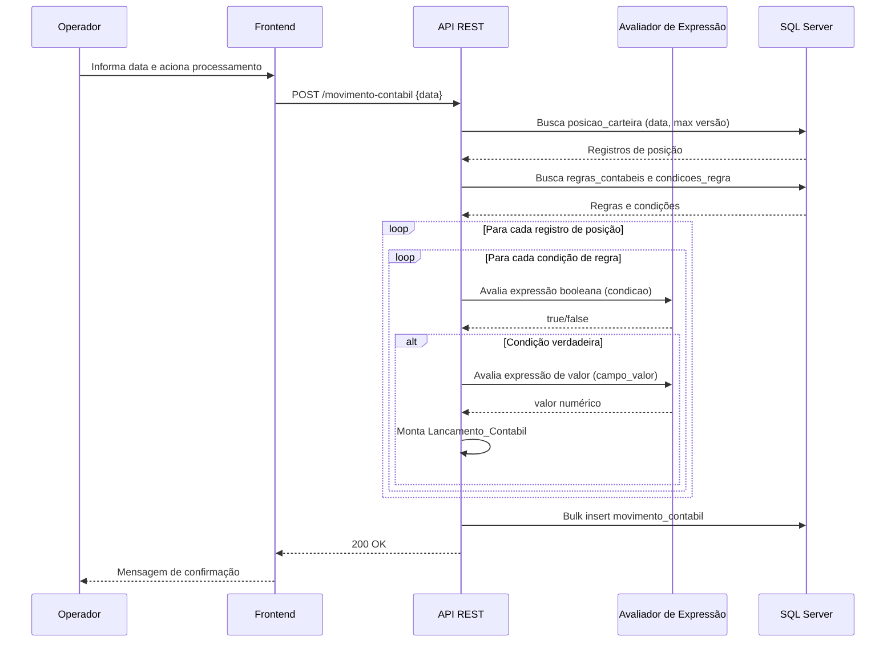

# Design Técnico — SRCOff: Roteirização Contábil Offshore

## Visão Geral

O SRCOff é um sistema de roteirização contábil que processa em lote a posição de carteira offshore da Tesouraria para uma data específica, aplica regras contábeis parametrizadas dinamicamente e persiste os lançamentos contábeis resultantes. O sistema também é responsável por estornar lançamentos de D-1 que divergem do lote atual e por consolidar o lote contábil final.

O sistema é composto por:
- **API REST** em Golang — toda a lógica de negócio, persistência e exposição de endpoints.
- **Frontend** em Golang (HTML/template) — interface web para operação e consulta.
- **Banco de Dados** Microsoft SQL Server Express — persistência de todos os dados.

### Fluxo Principal



---

## Arquitetura

### Estilo Arquitetural

Aplicação monolítica em Golang com separação em camadas:

```
cmd/
  api/        → ponto de entrada da API (main.go)
  frontend/   → ponto de entrada do frontend (main.go)
internal/
  handler/    → handlers HTTP (controllers)
  service/    → lógica de negócio
  repository/ → acesso ao banco de dados
  evaluator/  → avaliador de expressões dinâmicas
  model/      → structs de domínio
  db/         → inicialização e pool de conexão
```

### Decisões de Design

1. **Avaliador de Expressão Dinâmico**: Utilizar a biblioteca `github.com/expr-lang/expr` para avaliar expressões booleanas e aritméticas em tempo de execução. Essa biblioteca compila expressões para bytecode e é segura para uso concorrente.

2. **Bulk Insert**: Os lançamentos contábeis são acumulados em memória durante o processamento do lote e persistidos em uma única operação de bulk insert via `database/sql` com múltiplos `VALUES` na instrução SQL, evitando chamadas individuais ao banco.

3. **Trusted Connection**: A string de conexão utiliza `trusted_connection=yes` via driver `github.com/denisenkom/go-mssqldb`, sem necessidade de usuário/senha.

4. **Frontend com templates Go**: O frontend utiliza `html/template` da stdlib do Go, servindo páginas HTML com dados renderizados no servidor. Na exibição da posição de carteira, o frontend prioriza o mapa `Campos` de cada registro para renderização dinâmica das colunas; quando `Campos` não está disponível (fallback), os campos internos da struct (`ID`, `DataPosicaoCarteira`, `CodigoVersaoConteudo`, `CodigoIdentificadorBoleto`, `DescricaoVeiculo`, `IndicadorContraparteAfiliada`, `ValorMTM`, `PrincipalRemanescente`, `MoedaPrincipalRemanescente`) são removidos do mapa antes da exibição para evitar poluição visual no grid.

5. **Versionamento de conteúdo**: O campo `codigo_versao_conteudo` é calculado no momento da inserção como `MAX(codigo_versao_conteudo) + 1` para a data do lote, garantindo unicidade de versão por data. Para estornos, utiliza-se a versão vigente (`MAX`) sem incremento.

6. **Concatenação de SQL**: Devido a limitações do driver `go-mssqldb` com parâmetros nomeados, todas as queries utilizam concatenação direta de strings com escape de aspas simples (`''`) para valores textuais.

7. **Configuração via variáveis de ambiente**:
   - `STORAGE_BACKEND` — backend de persistência: `sqlserver` (padrão) ou `file`
   - `FILE_STORAGE_DIR` — diretório dos arquivos JSON quando `STORAGE_BACKEND=file` (padrão: `./data`)
   - `DB_SERVER` — servidor SQL Server (padrão: `DESKTOP-B1QQIIN\SQLEXPRESS`)
   - `DB_NAME` — nome do banco (padrão: `srcoff`)
   - `API_PORT` — porta da API (padrão: `8080`)
   - `FRONTEND_PORT` — porta do frontend (padrão: `9090`)
   - `API_URL` — URL da API consumida pelo frontend (padrão: `http://localhost:8080`)

8. **Conciliação em memória**: A conciliação entre posição e movimento é realizada inteiramente em memória no serviço, sem persistência de inconsistências no banco de dados.

9. **Backend de persistência plugável via interfaces**: Os repositórios são definidos como interfaces Go em `internal/repository/interfaces.go`. O `cmd/api/main.go` instancia a implementação correta (SQL Server ou arquivo) com base em `STORAGE_BACKEND`, sem que os serviços precisem conhecer o backend ativo.

---

## Arquitetura de Repositórios

```
internal/repository/
  interfaces.go              → interfaces PosicaoCarteiraRepository,
                               RegraContabilRepository, MovimentoContabilRepository
  posicao_carteira_repo.go   → implementação SQL Server
  regra_contabil_repo.go     → implementação SQL Server
  movimento_contabil_repo.go → implementação SQL Server
  file/
    store.go                 → helper genérico de leitura/escrita JSON
    posicao_carteira_repo.go → implementação arquivo JSON
    regra_contabil_repo.go   → implementação arquivo JSON
    movimento_contabil_repo.go → implementação arquivo JSON
```

### Interfaces de Repositório

```go
type PosicaoCarteiraRepository interface {
    BuscarPorDataEVersaoMaxima(ctx context.Context, data time.Time) ([]model.PosicaoCarteira, error)
}

type RegraContabilRepository interface {
    ListarRegrasAtivas(ctx context.Context) ([]model.RegraContabil, error)
    CriarRegra(ctx context.Context, regra model.RegraContabil) (int64, error)
    EditarRegra(ctx context.Context, regra model.RegraContabil) error
    ListarCondicoes(ctx context.Context, idRegra int64) ([]model.CondicaoRegra, error)
    CriarCondicao(ctx context.Context, condicao model.CondicaoRegra) (int64, error)
    EditarCondicao(ctx context.Context, condicao model.CondicaoRegra) error
}

type MovimentoContabilRepository interface {
    BulkInsert(ctx context.Context, lancamentos []model.LancamentoContabil) error
    BuscarPorDataEIndicador(ctx context.Context, data time.Time, indicadorReversao bool) ([]model.LancamentoContabil, error)
    ObterProximaVersao(ctx context.Context, data time.Time) (int, error)
    ObterVersaoAtual(ctx context.Context, data time.Time) (int, error)
    ConsultarPaginado(ctx context.Context, data time.Time, pagina, tamanho int) (*model.PaginaLancamentos, error)
    ConsultarPaginadoFiltrado(ctx context.Context, dataInicio, dataFim time.Time, boleto string, versao int, versaoModo string, pagina, tamanho int) (*model.PaginaLancamentos, error)
    // ConsultarPaginadoFiltradoSemCancelados é idêntico a ConsultarPaginadoFiltrado, mas exclui
    // grupos (boleto, valor, regra) cuja soma líquida de lançamentos é zero (cancelados entre si).
    ConsultarPaginadoFiltradoSemCancelados(ctx context.Context, dataInicio, dataFim time.Time, boleto string, versao int, versaoModo string, pagina, tamanho int) (*model.PaginaLancamentos, error)
    // ExcluirPorDataEVersao remove lançamentos de uma data; se versao > 0, filtra pela versão específica.
    ExcluirPorDataEVersao(ctx context.Context, data time.Time, versao int) error
}
```

### Backend Arquivo JSON

Quando `STORAGE_BACKEND=file`, os dados são armazenados em `FILE_STORAGE_DIR` (padrão `./data`):

| Arquivo | Conteúdo |
|---------|----------|
| `posicao_carteira.json` | Array de `PosicaoCarteira` |
| `regras.json` | Objeto com arrays de `RegraContabil`, `CondicaoRegra` e contadores de ID |
| `movimento_contabil.json` | Array de `LancamentoContabil` |

Todas as operações de leitura/escrita são protegidas por `sync.Mutex` para segurança em acesso concorrente.

---

## Componentes e Interfaces

### API REST — Endpoints

| Método | Caminho | Descrição |
|--------|---------|-----------|
| POST | `/api/v1/movimento-contabil` | Gera o movimento contábil para uma data |
| POST | `/api/v1/estorno` | Gera o estorno do lote de D-1 para uma data |
| GET | `/api/v1/movimento-contabil` | Consulta lançamentos paginados com filtros |
| GET | `/api/v1/movimento-contabil/export` | Exporta lançamentos filtrados em CSV (UTF-8 BOM, separador `;`) |
| GET | `/api/v1/conciliacao` | Concilia posição de carteira com movimento contábil |
| GET | `/api/v1/posicao` | Lista registros de posição por data |
| POST | `/api/v1/posicao` | Insere novo registro de posição |
| DELETE | `/api/v1/posicao?id={id}` | Exclui registro de posição pelo ID |
| GET | `/api/v1/regras` | Lista regras contábeis |
| POST | `/api/v1/regras` | Cria nova regra contábil |
| PUT | `/api/v1/regras/{id}` | Edita regra contábil |
| GET | `/api/v1/regras/{id}/condicoes` | Lista condições de uma regra |
| POST | `/api/v1/regras/{id}/condicoes` | Cria nova condição de regra |
| PUT | `/api/v1/condicoes/{id}` | Edita condição de regra |

### Payloads

**POST /api/v1/movimento-contabil**
```json
{ "data": "2024-01-15" }
```

**POST /api/v1/estorno**
```json
{ "data": "2024-01-15" }
```

**GET /api/v1/movimento-contabil — filtros disponíveis**
```
?data_inicio=2024-01-01&data_fim=2024-01-31&boleto=BOL-001&versao_modo=vigente&versao=1&pagina=1&tamanho=100
```
- `data_inicio` / `data_fim`: período (opcional; se omitidos, busca tudo)
- `boleto`: busca parcial por substring (opcional)
- `versao_modo`: `vigente` (padrão) | `todas` | `especifica`
- `versao`: número da versão (obrigatório quando `versao_modo=especifica`)
- `data`: compatibilidade com filtro por data única (legado)

**GET /api/v1/movimento-contabil/export — exportação CSV**
```
?data_inicio=2024-01-01&data_fim=2024-01-31&boleto=BOL-001&versao_modo=vigente&versao=1
```
- Aceita os mesmos filtros do endpoint de consulta (exceto paginação)
- Retorna arquivo CSV com BOM UTF-8 e separador `;` para compatibilidade com Excel
- Nome do arquivo: `movimento_contabil_{data_inicio}_{data_fim}.csv`
- Colunas: Data Lote, Versão, Boleto, Conta Débito, Conta Crédito, Valor, Moeda, Reversão, Regra, Condição

**GET /api/v1/conciliacao**
```
?data=2024-01-15
```

**Resposta paginada:**
```json
{
  "total": 1500,
  "pagina": 1,
  "tamanho": 100,
  "lancamentos": [ ... ]
}
```

**Resposta de conciliação:**
```json
{
  "Data": "2024-01-15",
  "TotalPosicoes": 100,
  "TotalMovimentos": 98,
  "Inconsistencias": [
    {
      "Tipo": "POSICAO_SEM_MOVIMENTO",
      "CodigoIdentificadorBoleto": "BOL-001",
      "DescricaoRegra": "",
      "IndicadorReversao": false,
      "Detalhe": "Boleto presente na posição de 2024-01-15 não possui lançamento contábil"
    }
  ]
}
```

### Avaliador de Expressão

Interface interna:

```go
type Evaluator interface {
    // Avalia expressão booleana sobre os campos do registro de posição
    EvaluateCondition(expr string, env map[string]interface{}) (bool, error)
    // Avalia expressão de valor sobre os campos do registro de posição
    EvaluateValue(expr string, env map[string]interface{}) (float64, error)
}
```

O `env` é construído dinamicamente pelo repositório a partir de `SELECT *` + `rows.ColumnTypes()`. Cada coluna é alocada com o tipo Go correto conforme o tipo SQL Server (`DECIMAL`→`float64`, `BIT`→`bool`, `DATE`→`time.Time`, etc.). Valores NULL são substituídos por zero-values antes da avaliação.

As expressões são compiladas **sem** `expr.Env()` (sem type-checking estático), permitindo que qualquer coluna presente na tabela seja referenciada nas regras sem recompilação. A função `sanitizeEnv` garante que valores `nil` sejam convertidos para `float64(0)` antes de passar ao avaliador.

### Serviços

```go
type MovimentoContabilService interface {
    GerarMovimento(ctx context.Context, data time.Time) error
    GerarEstorno(ctx context.Context, data time.Time) error
    ConsultarLancamentos(ctx context.Context, data time.Time, pagina, tamanho int) (*PaginaLancamentos, error)
    ConsultarLancamentosFiltrado(ctx context.Context, dataInicio, dataFim time.Time, boleto string, versao int, versaoModo string, pagina, tamanho int) (*PaginaLancamentos, error)
}

type RegraContabilService interface {
    ListarRegras(ctx context.Context) ([]RegraContabil, error)
    CriarRegra(ctx context.Context, regra RegraContabil) (int64, error)
    EditarRegra(ctx context.Context, regra RegraContabil) error
    ListarCondicoes(ctx context.Context, idRegra int64) ([]CondicaoRegra, error)
    CriarCondicao(ctx context.Context, condicao CondicaoRegra) (int64, error)
    EditarCondicao(ctx context.Context, condicao CondicaoRegra) error
}

type ConciliacaoService interface {
    Conciliar(ctx context.Context, data time.Time) (*ResultadoConciliacao, error)
}
```

---

## Modelos de Dados

### Tabelas do Banco de Dados

#### posicao_carteira
```sql
CREATE TABLE posicao_carteira (
    id                              BIGINT IDENTITY PRIMARY KEY,
    data_posicao_carteira           DATE NOT NULL,
    codigo_versao_conteudo          INT NOT NULL,
    codigo_identificador_boleto     VARCHAR(50) NOT NULL,
    descricao_veiculo               VARCHAR(100),
    indicador_contraparte_afiliada  BIT,
    valor_mtm                       DECIMAL(18,6),
    principal_remanescente          DECIMAL(18,6),
    moeda_principal_remanescente    VARCHAR(10),
    -- demais campos da posição conforme layout offshore
    INDEX IX_posicao_data_versao (data_posicao_carteira, codigo_versao_conteudo)
);
```

#### regra_contabil
```sql
CREATE TABLE regra_contabil (
    id                          BIGINT IDENTITY PRIMARY KEY,
    descricao                   VARCHAR(255) NOT NULL,
    codigo_produto_corporativo  VARCHAR(50) NOT NULL,
    ativo                       BIT NOT NULL DEFAULT 1
);
```

#### condicao_regra
```sql
CREATE TABLE condicao_regra (
    id          BIGINT IDENTITY PRIMARY KEY,
    id_regra    BIGINT NOT NULL REFERENCES regra_contabil(id),
    condicao    VARCHAR(1000) NOT NULL,
    conta_debito    VARCHAR(20) NOT NULL,
    conta_credito   VARCHAR(20) NOT NULL,
    campo_valor     VARCHAR(500) NOT NULL,
    campo_moeda     VARCHAR(100) NOT NULL,
    ativo           BIT NOT NULL DEFAULT 1
);
```

#### movimento_contabil
```sql
CREATE TABLE movimento_contabil (
    id                          BIGINT IDENTITY PRIMARY KEY,
    data_lote_contabil          DATE NOT NULL,
    codigo_versao_conteudo      INT NOT NULL,
    codigo_identificador_boleto VARCHAR(50) NOT NULL,
    valor_lancamento_contabil   DECIMAL(18,6) NOT NULL,
    moeda_lancamento_contabil   VARCHAR(10) NOT NULL,
    conta_debito                VARCHAR(20) NOT NULL,
    conta_credito               VARCHAR(20) NOT NULL,
    indicador_reversao          BIT NOT NULL DEFAULT 0,
    descricao_regra_contabil    VARCHAR(255),
    descricao_condicao_contabil VARCHAR(1000),
    id_regra_contabil           BIGINT REFERENCES regra_contabil(id),
    INDEX IX_movimento_data_versao (data_lote_contabil, codigo_versao_conteudo),
    INDEX IX_movimento_data_reversao (data_lote_contabil, indicador_reversao)
);
```

### Structs Go (model)

```go
// PosicaoCarteira mantém campos fixos para uso interno e um mapa dinâmico
// com TODOS os campos da linha, construído via SELECT * + ColumnTypes().
type PosicaoCarteira struct {
    ID                           int64
    DataPosicaoCarteira          time.Time
    CodigoVersaoConteudo         int
    CodigoIdentificadorBoleto    string
    DescricaoVeiculo             string
    IndicadorContraparteAfiliada bool
    ValorMTM                     float64
    PrincipalRemanescente        float64
    MoedaPrincipalRemanescente   string
    // Campos contém todos os campos da linha com chaves snake_case,
    // incluindo colunas adicionais não mapeadas nos campos fixos.
    Campos map[string]interface{}
}

type RegraContabil struct {
    ID                       int64
    Descricao                string
    CodigoProdutoCorporativo string
    Ativo                    bool
    Condicoes                []CondicaoRegra
}

type CondicaoRegra struct {
    ID          int64
    IDRegra     int64
    Condicao    string
    ContaDebito string
    ContaCredito string
    CampoValor  string
    CampoMoeda  string
    Ativo       bool
}

type LancamentoContabil struct {
    ID                        int64
    DataLoteContabil          time.Time
    CodigoVersaoConteudo      int
    CodigoIdentificadorBoleto string
    ValorLancamentoContabil   float64
    MoedaLancamentoContabil   string
    ContaDebito               string
    ContaCredito              string
    IndicadorReversao         bool
    DescricaoRegraContabil    string
    DescricaoCondicaoContabil string
    IDRegraContabil           int64
}

type Inconsistencia struct {
    Tipo                      TipoInconsistencia // "POSICAO_SEM_MOVIMENTO" | "LANCAMENTO_DUPLICADO"
    CodigoIdentificadorBoleto string
    DescricaoRegra            string
    IndicadorReversao         bool
    Detalhe                   string
}

type ResultadoConciliacao struct {
    Data            string
    TotalPosicoes   int
    TotalMovimentos int
    Inconsistencias []Inconsistencia
}
```

---

## Propriedades de Corretude

*Uma propriedade é uma característica ou comportamento que deve ser verdadeiro em todas as execuções válidas de um sistema — essencialmente, uma declaração formal sobre o que o sistema deve fazer. As propriedades servem como ponte entre especificações legíveis por humanos e garantias de corretude verificáveis por máquina.*

### Propriedade 1: Seleção da versão máxima da posição de carteira

*Para qualquer* conjunto de registros de posicao_carteira com múltiplas versões para a mesma data, o sistema deve selecionar exclusivamente os registros cujo codigo_versao_conteudo é igual ao maior valor disponível para aquela data, e nenhum registro de outra data deve ser incluído.

**Valida: Requisitos 1.1, 1.2**

---

### Propriedade 2: Avaliador de expressão é determinístico

*Para qualquer* expressão (booleana ou aritmética) e qualquer mapa de variáveis de entrada, o Avaliador_Expressao deve retornar o mesmo resultado toda vez que for invocado com os mesmos argumentos — tanto para avaliações de condição quanto para avaliações de valor.

**Valida: Requisitos 2.1, 2.2**

---

### Propriedade 3: Lançamentos gerados correspondem às condições satisfeitas

*Para qualquer* conjunto de registros de posicao_carteira e qualquer conjunto de condicoes_regra, o número de lançamentos gerados deve ser igual ao número de pares (registro, condição) para os quais a expressão booleana da condição é verdadeira — registros que não satisfazem nenhuma condição não geram lançamentos.

**Valida: Requisitos 3.1, 4.5**

---

### Propriedade 4: Campos do lançamento contábil são preenchidos corretamente

*Para qualquer* lançamento contábil gerado, todos os campos (conta_debito, conta_credito, valor_lancamento_contabil, moeda_lancamento_contabil, codigo_identificador_boleto, indicador_reversao=false, descricao_regra_contabil, descricao_condicao_contabil) devem corresponder exatamente aos valores da condicao_regra e do registro de posicao_carteira que o originaram.

**Valida: Requisitos 3.2, 3.3, 3.4, 3.5, 3.6, 3.7, 3.8, 3.9, 3.10**

---

### Propriedade 5: Versão do lote é sempre incrementada monotonicamente

*Para qualquer* data de lote, o codigo_versao_conteudo atribuído ao novo lote deve ser estritamente maior que todos os valores de codigo_versao_conteudo existentes na tabela movimento_contabil para aquela mesma data, ou igual a 1 se não houver registros anteriores.

**Valida: Requisito 3.11**

---

### Propriedade 6: Invariantes do estorno — inversão de contas e indicador de reversão

*Para qualquer* lançamento de D-1 que origina um estorno, o estorno gerado deve ter: conta_debito igual ao conta_credito do lançamento original, conta_credito igual ao conta_debito do lançamento original, e indicador_reversao igual a verdadeiro.

**Valida: Requisitos 5.4, 5.5**

---

### Propriedade 7: Estorno é gerado se e somente se há divergência ou ausência de correspondente

*Para qualquer* par de lotes (D-1, D), um estorno deve ser gerado se e somente se o lançamento de D-1 não possui correspondente em D pela chave (codigo_identificador_boleto, id_regra_contabil), ou possui correspondente com valor_lancamento_contabil diferente. Lançamentos com valores iguais não devem gerar estorno.

**Valida: Requisitos 5.4, 5.6, 5.7**

---

### Propriedade 8: Lote consolidado contém exatamente todos os lançamentos e estornos da data

*Para qualquer* data D processada com sucesso, a consulta ao lote consolidado deve retornar exatamente o conjunto de lançamentos com indicador_reversao=false mais o conjunto de estornos com indicador_reversao=true gerados para aquela data — sem omissões e sem duplicatas.

**Valida: Requisitos 6.1, 6.2**

---

### Propriedade 9: Paginação retorna subconjunto correto e total consistente

*Para qualquer* data e qualquer combinação válida de página e tamanho de página, a união dos registros retornados em todas as páginas deve ser igual ao conjunto completo de lançamentos da data, o total informado pela API deve ser consistente com esse conjunto, e nenhum lançamento deve aparecer em mais de uma página.

**Valida: Requisitos 9.2, 9.3**

---

## Tratamento de Erros

| Situação | Comportamento |
|----------|--------------|
| Nenhum registro de posicao_carteira para a data | Retorna HTTP 200 com mensagem indicando ausência de dados; nenhum lançamento é gerado |
| Expressão booleana inválida para um registro | Registra erro no log; prossegue para o próximo registro sem interromper o lote |
| Expressão de valor inválida para um registro | Registra erro no log; prossegue para o próximo registro sem interromper o lote |
| Nenhum lote em D-1 para estorno | Retorna HTTP 200 com mensagem indicando ausência de lote em D-1; nenhum estorno é gerado |
| Falha na conexão com o banco na inicialização | Registra erro no log e encerra com código de saída != 0 |
| Erro de validação no frontend (campo obrigatório vazio) | Exibe mensagem de validação; impede envio do formulário |
| API retorna erro para processamento/estorno | Frontend exibe a mensagem de erro retornada pela API |

### Estratégia de Log

- Todos os erros de avaliação de expressão são registrados com: data do lote, codigo_identificador_boleto, expressão que falhou e mensagem de erro.
- Erros de infraestrutura (banco, rede) são registrados com stack trace.
- Nível de log configurável via variável de ambiente `LOG_LEVEL`.

---

## Estratégia de Testes

### Abordagem Dual

O projeto adota dois tipos complementares de teste:

- **Testes unitários**: verificam exemplos específicos, casos de borda e condições de erro.
- **Testes de propriedade (PBT)**: verificam propriedades universais sobre conjuntos de entradas geradas aleatoriamente.

### Testes Unitários

Focados em:
- Exemplos concretos das regras NDF (Requisito 4): cada combinação de condição com valores específicos.
- Integração entre camadas (handler → service → repository).
- Casos de borda: posição vazia, lote D-1 inexistente, expressão inválida.
- Validação de formulários no frontend.

### Testes de Propriedade (PBT)

**Biblioteca**: `github.com/leanovate/gopter` (Go) — biblioteca madura de property-based testing para Go, com suporte a geradores arbitrários e shrinking.

**Configuração mínima**: 100 iterações por propriedade (`gopter.NewProperties` com `MinSuccessfulTests: 100`).

**Formato de tag obrigatório em cada teste**:
```
// Feature: srcoff-roteirizacao-contabil-offshore, Property N: <texto da propriedade>
```

Cada propriedade de corretude listada na seção anterior deve ser implementada por **um único** teste de propriedade.

#### Mapeamento Propriedade → Teste

| Propriedade | Descrição do Teste |
|-------------|-------------------|
| P1 | Gera registros com múltiplas versões e datas variadas; verifica que apenas os registros da data correta com a versão máxima são selecionados |
| P2 | Gera expressões booleanas e aritméticas com envs aleatórios; verifica determinismo chamando duas vezes com os mesmos argumentos |
| P3 | Gera posições e condições aleatórias; conta pares satisfeitos e compara com lançamentos gerados; verifica ausência de lançamentos para registros sem condição satisfeita |
| P4 | Gera posições e condições aleatórias; verifica todos os campos de cada lançamento contra a origem (posição + condição) |
| P5 | Gera lotes para a mesma data em sequência; verifica que cada versão é estritamente maior que a anterior e que a primeira versão é 1 |
| P6 | Gera lançamentos de D-1 aleatórios com divergência de valor; verifica inversão de contas e indicador_reversao=true nos estornos |
| P7 | Gera pares de lotes (D-1, D) aleatórios com combinações de igualdade/divergência/ausência; verifica que estornos são gerados se e somente se há divergência ou ausência |
| P8 | Gera lotes completos com movimento e estorno; verifica que a consulta retorna exatamente lançamentos + estornos da data sem omissões ou duplicatas |
| P9 | Gera lotes com N lançamentos aleatórios; itera todas as páginas e verifica que a união é igual ao total sem duplicatas e que o total retornado é consistente |

---

## Atualizações de Design — Funcionalidades Recentes

### Backend de Persistência Configurável

A API suporta dois backends via variável de ambiente `STORAGE_BACKEND`:

| Valor | Backend | Descrição |
|-------|---------|-----------|
| `sqlserver` (padrão) | SQL Server | Usa `go-mssqldb` com queries concatenadas |
| `file` | Arquivo JSON | Persiste em `./data/*.json`, operações em memória |

**Variáveis de ambiente:**
- `STORAGE_BACKEND` — `sqlserver` ou `file`
- `FILE_STORAGE_DIR` — diretório dos arquivos JSON (padrão: `./data`)

**Estrutura de arquivos JSON:**
```
data/
  posicao_carteira.json   — registros de posição
  regras.json             — regras e condições contábeis
  movimento_contabil.json — lançamentos contábeis
```

### Carregamento Dinâmico de Campos da Posição

O repositório de posição usa `SELECT *` + `rows.ColumnTypes()` para scan dinâmico:

```go
func allocForType(dbType string, nullable bool) interface{} {
    // DECIMAL/NUMERIC/FLOAT → *float64 ou *sql.NullFloat64
    // BIT → *bool ou *sql.NullBool
    // DATE/DATETIME → *time.Time ou *sql.NullTime
    // VARCHAR/NVARCHAR → *string ou *sql.NullString
}
```

Valores `NULL` são convertidos para zero values (`0.0`, `false`, `""`) para compatibilidade com o avaliador de expressões.

### Novos Endpoints da API

| Método | Caminho | Descrição |
|--------|---------|-----------|
| GET | `/api/v1/posicao` | Lista posições por data |
| POST | `/api/v1/posicao` | Insere novo registro de posição |
| DELETE | `/api/v1/posicao?id={id}` | Exclui registro de posição |
| DELETE | `/api/v1/movimento-contabil?data=...&versao=...` | Exclui lançamentos por data/versão |
| GET | `/api/v1/movimento-contabil/export` | Exporta CSV com filtros |
| GET | `/api/v1/movimento-contabil/export-txt?data=...` | Exporta TXT estruturado |

### Formato do Arquivo TXT de Exportação

```
C;20260409                          ← Cabeçalho: C fixo + data AAAAMMDD
D;111111111;D;USD;Regra NDF;BOL-001;N;101500.000000  ← Detalhe débito
D;222222222;C;USD;Regra NDF;BOL-001;N;101500.000000  ← Detalhe crédito
T;203000.000000                     ← Totalizador: T fixo + soma
```

Campos da linha de detalhe: `D;{conta};{D/C};{moeda};{regra};{boleto};{S/N};{valor}`

### Filtro de Saldo Zero na Consulta

A consulta do frontend usa subquery para eliminar pares cancelados:

```sql
AND (
    SELECT SUM(CASE WHEN indicador_reversao = 0
                    THEN  valor_lancamento_contabil
                    ELSE -valor_lancamento_contabil END)
    FROM movimento_contabil m2
    WHERE m2.data_lote_contabil = m.data_lote_contabil
      AND m2.codigo_identificador_boleto = m.codigo_identificador_boleto
      AND m2.valor_lancamento_contabil = m.valor_lancamento_contabil
      AND m2.id_regra_contabil = m.id_regra_contabil
) <> 0
```

Este filtro é aplicado **apenas** em `ConsultarPaginadoFiltradoSemCancelados` — usado pelo frontend. Estorno e conciliação usam `ConsultarPaginadoFiltrado` sem este filtro.

### Páginas do Frontend

| Rota | Descrição |
|------|-----------|
| `/operacao` | Gerar movimento contábil e estorno |
| `/consulta` | Consultar, exportar (CSV/TXT) e excluir movimento contábil |
| `/posicao` | Inserir, consultar e excluir registros de posição |
| `/conciliacao` | Conciliar posição × movimento contábil |
| `/regras` | Cadastrar e manter regras e condições contábeis |
