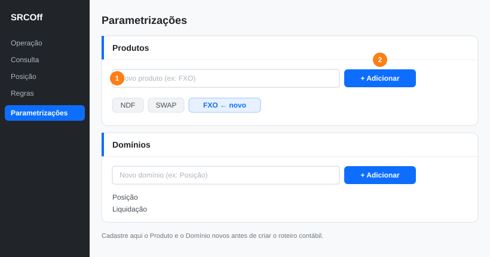
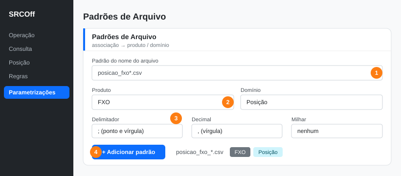
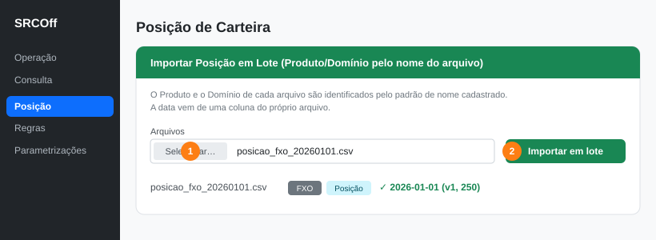
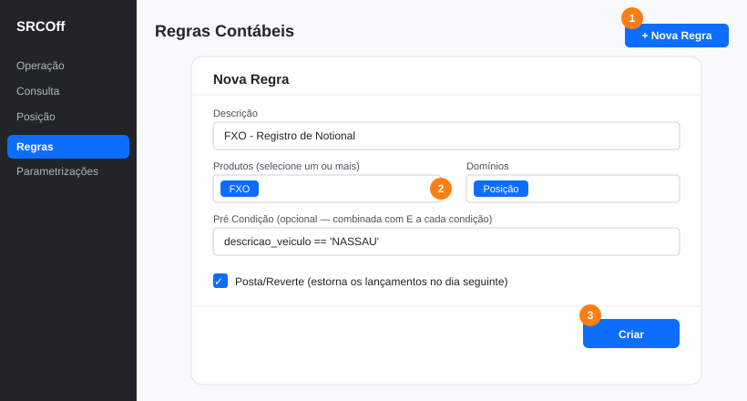
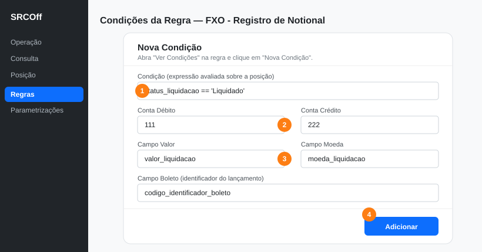
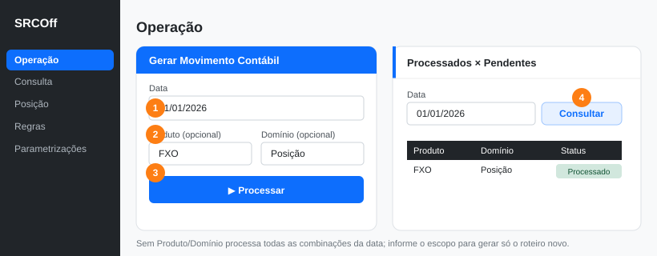
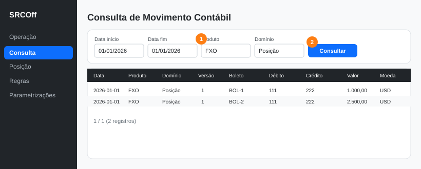

# SRCOff — Sistema de Roteirização Contábil Offshore

Sistema desenvolvido em Go para geração, estorno, conciliação e consulta do movimento contábil diário da Tesouraria Offshore.

---

## Sumário

- [Visão Geral](#visão-geral)
- [Funcionalidades da Solução](#funcionalidades-da-solução)
- [Passo a Passo: Parametrizar um Roteiro Contábil](#passo-a-passo-parametrizar-um-roteiro-contábil-novo-produtodomínio)
- [Tecnologias](#tecnologias)
- [Estrutura do Projeto](#estrutura-do-projeto)
- [Configuração e Execução](#configuração-e-execução)
- [Estrutura do Banco de Dados](#estrutura-do-banco-de-dados)
- [API REST](#api-rest)
- [Regras Contábeis — Expressões](#regras-contábeis--expressões)
- [Formato do Arquivo TXT](#formato-do-arquivo-txt)

---

## Visão Geral

O SRCOff processa em lote os registros de posição de carteira offshore para uma data específica, aplica regras contábeis parametrizadas dinamicamente e persiste os lançamentos contábeis resultantes. O sistema também realiza estorno do lote anterior, conciliação e exportação dos dados.

**Fluxo principal:**
1. Operador insere/importa posição de carteira no banco
2. Aciona geração do movimento contábil para uma data
3. Aciona geração do estorno (reverte lançamentos de D-1)
4. Consulta e exporta o lote contábil consolidado

---

## Passo a Passo: Parametrizar um Roteiro Contábil (Novo Produto/Domínio)

> **Roteiro contábil** = o conjunto de **todas as regras contábeis** de um determinado Produto (por exemplo, todas as regras do produto **FXO**). Este guia mostra, do zero, como habilitar um novo Produto/Domínio e deixar o movimento contábil sendo gerado a partir dos arquivos de posição.

Neste exemplo vamos criar o roteiro do produto **FXO**, domínio **Posição**.

### Passo 1 — Cadastrar o Produto e o Domínio

Menu **Parametrizações**. Nos cartões **Produtos** e **Domínios**, cadastre os valores novos (eles passam a aparecer em todos os combos do sistema).



1. Digite o novo produto (ex.: `FXO`) no campo.
2. Clique em **Adicionar**. Repita no cartão **Domínios** (ex.: `Posição`).

### Passo 2 — Associar o padrão do nome do arquivo

Ainda em **Parametrizações**, no cartão **Padrões de Arquivo**, diga ao sistema como reconhecer o Produto/Domínio pelo **nome do arquivo**, qual é a **coluna de data base** e o **formato de data** do arquivo.



1. Informe o padrão do nome com curinga `*` (ex.: `posicao_fxo*.csv`).
2. Selecione o **Produto** (`FXO`) e o **Domínio** (`Posição`).
3. **Coluna da Data Base da Posição** (obrigatório): o nome da coluna do arquivo que define a **data do lote** (ex.: `data_posicao_carteira`).
4. **Formato de Data** (obrigatório): o formato das colunas de data do arquivo — agrupado em **Padrão Brasil** (`DD/MM/AAAA`…) e **Padrão EUA** (`MM/DD/AAAA`…). Vale para **todas** as colunas de data e resolve a ambiguidade DD/MM vs MM/DD.
5. (Opcional) Ajuste os **separadores** do CSV — Delimitador, Decimal e Milhar (deixe em "auto/nenhum" se não souber). Clique em **Adicionar padrão**.

> A partir daqui, qualquer arquivo cujo nome case com o padrão é reconhecido como `FXO / Posição` na importação, com a data e os números interpretados conforme o formato configurado.

### Passo 3 — Importar a posição

Menu **Posição**, cartão **Importar Posição em Lote**. Isso carrega os dados e faz o sistema conhecer as **colunas** do arquivo (que você vai referenciar nas regras).



1. Selecione um ou vários arquivos (ex.: `posicao_fxo_20260101.csv`).
2. Clique em **Importar em lote**. O Produto/Domínio, a coluna de data base e o formato de data vêm do **padrão de arquivo** cadastrado no passo 2.

### Passo 4 — Criar as regras do roteiro

Menu **Regras** → **Nova Regra**. Cada regra é uma peça do roteiro contábil do Produto/Domínio.



1. Preencha a **Descrição** (ex.: `FXO - Registro de Notional`).
2. Selecione o(s) **Produto(s)** e **Domínio(s)** a que a regra se aplica (`FXO` / `Posição`).
3. Informe o **Campo Data** (coluna do arquivo com a data) e, opcionalmente, uma **Pré Condição** e a flag **Posta/Reverte**. Clique em **Criar**.

> Repita este passo para **cada** regra do produto — juntas, elas formam o roteiro contábil.

### Passo 5 — Definir as condições de cada regra

Na lista de regras, clique em **Ver Condições** e depois em **Nova Condição**. A condição diz **quando** lançar e **em quais contas**.



1. **Condição** — expressão avaliada sobre a posição (ex.: `status_liquidacao == 'Liquidado'`).
2. **Conta Débito** e **Conta Crédito**.
3. **Campo Valor** e **Campo Moeda** — colunas do arquivo com o valor e a moeda.
4. **Campo Boleto** (identificador do lançamento) e clique em **Adicionar**.

### Passo 6 — Gerar o movimento contábil

Menu **Operação** → **Gerar Movimento Contábil**. Você pode processar toda a data ou só o escopo `FXO / Posição`.



1. Informe a **Data**.
2. (Opcional) Selecione **Produto** e **Domínio** para processar só o escopo novo.
3. Clique em **Processar**.
4. Confira em **Processados × Pendentes** se a combinação `FXO / Posição` ficou como **Processado**.

> A versão do movimento é **por Produto/Domínio**: a primeira execução de `FXO / Posição` começa na **versão 1**, independente das versões de outros produtos.

### Passo 7 — Consultar o resultado

Menu **Consulta**. Filtre por **Produto** e **Domínio** para ver os lançamentos gerados pelo roteiro.



1. Selecione **Produto** (`FXO`) e **Domínio** (`Posição`) e o período.
2. Clique em **Consultar**. Use **Excel/TXT** para exportar.

> **Automação (opcional):** em **Parametrizações → Pastas de Importação**, configure a pasta monitorada e o intervalo de varredura. Arquivos que casam com o padrão são importados e o contábil do escopo é gerado automaticamente — sem precisar repetir os passos 3 e 6.

---

## Tecnologias

| Componente | Tecnologia |
|-----------|-----------|
| Linguagem | Go 1.21 |
| Banco de dados | Microsoft SQL Server Express |
| Driver SQL | `github.com/denisenkom/go-mssqldb` |
| Avaliador de expressões | `github.com/expr-lang/expr` |
| Leitura de XLSX | `github.com/xuri/excelize/v2` |
| Testes de propriedade | `github.com/leanovate/gopter` |
| Frontend | HTML/template (stdlib Go) |

---

## Estrutura do Projeto

```
srcoff/
├── cmd/
│   ├── api/                    → Ponto de entrada da API REST
│   │   └── main.go
│   └── frontend/               → Ponto de entrada do Frontend
│       ├── main.go
│       └── templates/
│           ├── operacao.html
│           ├── consulta.html
│           ├── posicao.html
│           ├── conciliacao.html
│           └── regras.html
├── internal/
│   ├── db/                     → Conexão com banco de dados
│   ├── evaluator/              → Avaliador de expressões dinâmicas
│   ├── handler/                → Handlers HTTP da API
│   ├── model/                  → Structs de domínio
│   ├── repository/             → Repositórios SQL Server
│   │   └── file/               → Repositórios baseados em arquivo JSON
│   └── service/                → Lógica de negócio
├── migrations/
│   ├── 001_create_tables.sql   → DDL das tabelas
│   ├── seed_regras_condicoes.sql
│   └── seed_posicao_carteira_20260409.sql
└── data/                       → Arquivos JSON (backend file)
```

---

## Configuração e Execução

### Variáveis de Ambiente

| Variável | Padrão | Descrição |
|----------|--------|-----------|
| `STORAGE_BACKEND` | `file` | Backend de persistência: `sqlserver` ou `file` |
| `DB_SERVER` | `LOCALHOST\SQLEXPRESS` | Servidor SQL Server |
| `DB_NAME` | `srcoff` | Nome do banco de dados |
| `API_PORT` | `8080` | Porta da API |
| `FRONTEND_PORT` | `9090` | Porta do Frontend |
| `API_URL` | `http://localhost:8080` | URL da API consumida pelo frontend |
| `FILE_STORAGE_DIR` | `./data` | Diretório dos arquivos JSON (backend file) |
| `CAMPO_BOLETO_PADRAO` | `codigo_identificador_boleto` | Campo da posição usado como identificador do boleto na conciliação/exportação e como fallback quando a condição não define `campo_boleto` |

### Executar com SQL Server

```bash
# Configurar servidor (se diferente do padrão)
set DB_SERVER=localhost\SQLEXPRESS

# Compilar
go build -o api.exe ./cmd/api
go build -o frontend.exe ./cmd/frontend

# Executar (dois terminais separados)
.\api.exe
.\frontend.exe
```

### Executar com Backend de Arquivo (sem SQL Server)

```bash
set STORAGE_BACKEND=file
set FILE_STORAGE_DIR=./data

.\api.exe
.\frontend.exe
```

### Acessar o sistema

- Frontend: http://localhost:9090
- API: http://localhost:8080

---

## Estrutura do Banco de Dados

### posicao_carteira

Armazena a posição diária de carteira offshore, de forma **totalmente dinâmica**.
Apenas os metadados do lote são colunas fixas; todos os campos de negócio ficam
serializados em JSON na coluna `campos`. Suporta múltiplas versões por data.

| Coluna | Tipo | Descrição |
|--------|------|-----------|
| `id` | BIGINT IDENTITY PK | Identificador único |
| `data_posicao_carteira` | DATE | Data da posição (informada no upload) |
| `codigo_versao_conteudo` | INT | Versão do conteúdo (maior = mais recente) |
| `campos` | NVARCHAR(MAX) | JSON com todos os campos de negócio do arquivo importado |

> **Não há acoplamento** entre a estrutura da posição e o código. Qualquer coluna
> do arquivo importado (CSV/XLSX) fica disponível nas expressões das regras pelo
> seu nome normalizado (snake_case, sem acento). Backend `file`: cada registro é
> um mapa JSON flat. Aplique a migration `002_posicao_dinamica.sql` no SQL Server.

### regra_contabil

Define as regras de roteamento contábil.

| Coluna | Tipo | Descrição |
|--------|------|-----------|
| `id` | BIGINT IDENTITY PK | Identificador único |
| `descricao` | VARCHAR(255) | Nome da regra |
| `codigo_produto_corporativo` | VARCHAR(50) | Código(s) do produto, separados por vírgula (ex: `NDF,SWAP`) — opcional |
| `campo_produto` | VARCHAR(100) | Campo da posição comparado com o produto (default: `produto`) |
| `campo_data` | VARCHAR(100) | Nome da coluna do arquivo que contém a data da posição (usado na importação) |
| `pre_condicao` | VARCHAR(1000) | Expressão opcional combinada com **E** a cada condição da regra |
| `dominio` | VARCHAR(255) | Domínio(s) da regra, separados por vírgula (ex: `Posição,Liquidação`) — opcional |
| `posta_reverte` | BIT | Se os lançamentos da regra são estornados no dia seguinte |
| `ativo` | BIT | Se a regra está ativa |

> A regra só é aplicada às posições cujo **produto** (informado no upload e gravado no campo `produto`) coincide com `codigo_produto_corporativo`. Ex.: ao processar uma posição de NDF, apenas as regras de NDF são aplicadas. Regra sem produto aplica-se a todas as posições.
>
> **Pré-condição:** quando preenchida, é avaliada uma vez por posição/regra; se falsa, nenhuma condição da regra é aplicada. Útil para fatorar uma condição comum a várias condições da regra (ex: `descricao_veiculo == "NASSAU"`), evitando repeti-la em cada condição.
>
> **Campo Data:** na importação, a coluna de data é determinada pelo `campo_data` da regra do produto informado; se não configurado, o sistema tenta detectar automaticamente uma coluna cujo nome comece com `data`.

### condicao_regra

Define as condições e contas de cada regra.

| Coluna | Tipo | Descrição |
|--------|------|-----------|
| `id` | BIGINT IDENTITY PK | Identificador único |
| `id_regra` | BIGINT FK | Regra pai |
| `condicao` | VARCHAR(1000) | Expressão booleana (ex: `valor_mtm > 0 && descricao_veiculo == "NASSAU"`) |
| `conta_debito` | VARCHAR(20) | Conta de débito do lançamento |
| `conta_credito` | VARCHAR(20) | Conta de crédito do lançamento |
| `campo_valor` | VARCHAR(500) | Expressão para calcular o valor (ex: `principal_remanescente + valor_mtm`) |
| `campo_moeda` | VARCHAR(100) | Campo da posição que contém a moeda |
| `campo_boleto` | VARCHAR(100) | Campo da posição usado como identificador do boleto no lançamento (fallback: `CAMPO_BOLETO_PADRAO`) |
| `ativo` | BIT | Se a condição está ativa |

### movimento_contabil

Armazena os lançamentos contábeis gerados.

| Coluna | Tipo | Descrição |
|--------|------|-----------|
| `id` | BIGINT IDENTITY PK | Identificador único |
| `data_lote_contabil` | DATE | Data do lote |
| `codigo_versao_conteudo` | INT | Versão do lote |
| `codigo_identificador_boleto` | VARCHAR(50) | Boleto de origem |
| `valor_lancamento_contabil` | DECIMAL(18,6) | Valor do lançamento |
| `moeda_lancamento_contabil` | VARCHAR(10) | Moeda |
| `conta_debito` | VARCHAR(20) | Conta de débito |
| `conta_credito` | VARCHAR(20) | Conta de crédito |
| `indicador_reversao` | BIT | `0` = lançamento normal, `1` = estorno |
| `descricao_regra_contabil` | VARCHAR(255) | Nome da regra que originou |
| `descricao_condicao_contabil` | VARCHAR(1000) | Expressão da condição |
| `id_regra_contabil` | BIGINT FK | Regra de origem |

---

## Funcionalidades da Solução

O sistema é uma SPA com menu lateral. Abaixo, cada funcionalidade em detalhe, com a tela correspondente. Para configurar tudo do zero, veja o [Passo a Passo](#passo-a-passo-parametrizar-um-roteiro-contábil-novo-produtodomínio).

Menus: **Operação**, **Consulta**, **Posição**, **Regras**, **Parametrizações** — mais o **sino de Notificações** (topo direito).

### Operação (`/operacao`)

Página principal para acionar o processamento diário do contábil. Reúne três blocos: gerar o movimento, acompanhar o que já foi processado e consultar inconsistências.


**Gerar Movimento Contábil:**
- Informe uma data e, opcionalmente, um **Produto** e/ou **Domínio** para restringir o escopo
- O sistema busca a posição de carteira (versão máxima) para a data, filtrando pelo escopo
- Avalia as regras ativas do escopo (regra casa por **Produto E Domínio**) e persiste os lançamentos
- Cada lançamento guarda o **Produto** e o **Domínio**; o estorno de D-1 também é restrito ao escopo
- Sem Produto/Domínio, processa todas as combinações da data
- A **versão** do movimento é por **(data, Produto, Domínio)**: a primeira execução de um Produto/Domínio começa na **versão 1**, independente das versões de outros produtos; reprocessar cria uma nova versão

**Processados × Pendentes:**
- Para uma data, lista as combinações (Produto, Domínio) dos **padrões de arquivo** cadastrados em Parametrizações e o status: **Processado** (contábil já executado) ou **Pendente**
- **Inconsistências:** se a pré-condição, condição ou campo_valor de uma regra referenciar um campo que **não existe** na posição, o lançamento **não é gerado** e uma inconsistência é registrada. Após o processamento, as inconsistências da data são listadas na tela.

**Inconsistências do Processamento:**
- As inconsistências são persistidas por data do movimento e podem ser consultadas informando a data
- Cada registro traz boleto, produto, regra, tipo (`PRE_CONDICAO` / `CONDICAO` / `CAMPO_VALOR`), a expressão que falhou, os campos faltantes e o detalhe
- Botão **Exportar CSV** gera um arquivo com esses detalhes (BOM UTF-8, separador `;`)
- Reprocessar a mesma data **substitui** as inconsistências anteriores

**Gerar Estorno:**
- Informe uma data D e clique em "Estornar"
- O sistema busca todos os lançamentos de D-1
- Gera estornos com contas invertidas e `indicador_reversao = true`
- Os estornos são persistidos com a mesma versão do lote de D

---

### Consulta de Movimento Contábil (`/consulta`)

Página para consultar, exportar e excluir lançamentos.


**Filtros disponíveis:**
- Data início / Data fim
- **Produto** e **Domínio** (opcionais)
- Número do boleto (busca parcial)
- Versão: **Vigente** (maior por combinação), **Todas** ou **Específica**. Na opção **Específica**, o **Produto e o Domínio passam a ser obrigatórios** (a versão é por combinação)
- Registros por página: 10, 50, 100

**Grid de resultados:**
- Exibe: Data, **Produto**, **Domínio**, Versão, Boleto, Conta Débito, Conta Crédito, Valor, Moeda, Reversão, Regra
- Lançamentos com saldo líquido zero (par lançamento + estorno) são automaticamente ocultados
- Paginação com navegação anterior/próxima e contagem total

**Exportar Excel (CSV):**
- Botão "⬇ Excel" ao lado do "Consultar"
- Usa os mesmos filtros da pesquisa atual
- Gera arquivo `.csv` com BOM UTF-8, separador `;`

**Exportar TXT:**
- Seção separada com campo de data única
- Gera arquivo `.txt` no formato estruturado (ver seção abaixo)
- Exibe mensagem se não há dados para a data

**Excluir Movimento:**
- Informe data (obrigatória) e versão (opcional)
- Se versão omitida, exclui todos os lançamentos da data
- Confirmação via dialog antes de excluir

---

### Posição de Carteira (`/posicao`)

Página **somente leitura + importação** — não há mais inserção nem exclusão manual de registros.


**Consultar:**
- **Produto** e **Domínio** são **obrigatórios**; informe uma data (ou período) e clique em "Consultar"
- Exibe grid **dinâmico** com as colunas exatamente como estão na posição (todas as colunas do arquivo importado), com **paginação** (10/50/100 por página) igual à consulta de movimento

**Importar em lote (Produto/Domínio pelo nome do arquivo):**
- Selecione **um ou vários arquivos** de uma vez; o **Produto**, o **Domínio**, a **coluna de data base** e o **formato de data** de cada arquivo vêm do **padrão de nome** cadastrado em Parametrizações (ex: `posicao_ndf*.csv` → NDF/Posição)
- Um arquivo que casa com **mais de um padrão** é importado para **cada combinação** correspondente
- A **data do lote** vem da coluna informada no padrão; o resultado por arquivo mostra Produto/Domínio, data, versão e total

**Pasta monitorada (automático):**
- Uma **pasta monitorada** parametrizada é varrida periodicamente e também sob demanda ("Escanear agora")
- O **intervalo de varredura é parametrizável em minutos**; se estiver vazio ou 0, o monitoramento automático fica **desativado** (o botão "Escanear agora" continua funcionando)
- Arquivos que casam com um padrão são importados e **movidos** para a **pasta de processados** (também parametrizada)
- Arquivos **sem padrão** correspondente **permanecem intactos** na pasta monitorada
- **Após a importação automática, o contábil é executado automaticamente** para o (Produto, Domínio, data) importado — e o usuário é **notificado** (sino no topo). A importação **manual** (botão "Importar em lote") não dispara o contábil nem notifica.

> **Domínio** é uma dimensão paralela ao Produto: parametrizável em Parametrizações, presente no cadastro da regra (lista, como o Produto), na consulta da posição e no padrão de arquivo (`nome → Produto + Domínio`). O contábil e o versionamento consideram a combinação (Produto, Domínio).

> A importação apenas **persiste a posição** — não avalia as regras contábeis. As regras (condições, pré-condições) só são aplicadas ao **Gerar Movimento Contábil**.
- A primeira linha do arquivo deve conter os **nomes das colunas**; qualquer coluna é aceita e fica disponível nas regras
- A **versão** é atribuída automaticamente por **(data, Produto, Domínio)**, de modo que combinações distintas da mesma data coexistem no snapshot vigente
- Números com separador configurável (ou vírgula decimal no formato BR) e valores `true/false`/`sim/não` são convertidos automaticamente; as **datas** seguem o formato do padrão

---

### Parametrizações (`/parametrizacoes`)

Menu para manter as opções e regras de leitura usadas em todo o sistema. Quatro blocos:


- **Produtos** — lista de produtos usada nos combos (padrões de arquivo e cadastro de regra). Adicione/remova opções livremente.
- **Domínios** — lista de domínios (ex.: `Posição`, `Liquidação`), usada da mesma forma.

Os campos Produto e Domínio deixam de ser texto livre e passam a ser selecionados a partir dessas listas.


- **Padrões de Arquivo → Produto/Domínio** — mapeia um padrão de nome de arquivo (glob, ex: `posicao_ndf*.csv`) a um Produto e Domínio. Usado na importação em lote e no monitoramento de pasta. Um arquivo pode casar com mais de um padrão (importa para cada combinação). Ao cadastrar, informe (obrigatórios):
  - **Coluna da Data Base da Posição** — nome da coluna do arquivo que define a **data do lote** (ex.: `data_posicao_carteira`).
  - **Formato de Data** — formato de **todas** as colunas de data, agrupado em **Padrão Brasil** (`AAAA/MM/DD`, `AAAA-MM-DD`, `DD/MM/AAAA`, `DD-MM-AAAA`) e **Padrão EUA** (`AAAA/DD/MM`, `AAAA-DD-MM`, `MM/DD/AAAA`, `MM-DD-AAAA`). Resolve a ambiguidade DD/MM vs MM/DD.
  - Opcionalmente, os **separadores do CSV** — **delimitador** (`;`/`,`/auto), **separador decimal** (`,`/`.`/auto) e **separador de milhar** (`.`/`,`/nenhum) — resolvendo formatos como `1.500.000,50`. Vazios = detecção automática.
- **Pastas de Importação** — configura a **pasta monitorada** (varrida automaticamente), a **pasta de processados** (para onde os arquivos importados são movidos) e o **intervalo de varredura em minutos**.

---

### Conciliação (`/conciliacao`)

Página para verificar inconsistências entre posição e movimento contábil. Tem duas modalidades: **Conciliação Simples** (regras fixas) e **Conciliação Inteligente com IA** (linguagem natural, via Gemini — ver [seção abaixo](#conciliação-inteligente-com-ia-gemini)).


**Como usar (Simples):**
- Informe uma data e clique em "Conciliar"
- O sistema compara a posição (versão máxima) com o movimento (versão vigente)

**Inconsistências detectadas:**

| Tipo | Descrição |
|------|-----------|
| `POSICAO_SEM_MOVIMENTO` | Boleto presente na posição sem lançamento no movimento |
| `LANCAMENTO_DUPLICADO` | Mais de um lançamento para mesmo boleto + regra + indicador de reversão |

**Resultado:**
- Resumo: total de posições, total de movimentos, quantidade de inconsistências
- Grid com tipo (badge colorido), boleto, regra, reversão e detalhe
- Mensagem verde quando não há inconsistências

---

### Regras Contábeis (`/regras`)

Página para cadastrar e manter as regras de roteamento contábil. O conjunto de todas as regras de um Produto forma o seu **roteiro contábil**.


**Regras (grid):**
- Lista as regras ativas com colunas: **ID**, **Regra** (`Produto - Domínio - Descrição`), Descrição, Produtos, Domínios, Pré Condição e Posta/Reverte
- Botão "Ver Condições" para abrir/gerenciar as condições de cada regra
- Busca por texto (descrição, produto, condição…)


**Nova Regra:**
- **Descrição**; **Produtos** e **Domínios** (listas — a regra casa por Produto **E** Domínio; vazio = todas as posições/domínios)
- **Campo Data** (coluna do arquivo com a data), **Pré Condição** (opcional, combinada com E a cada condição) e a flag **Posta/Reverte** (se desmarcada, os lançamentos desta regra **não são estornados**)


**Condições:**
- Cada condição define **quando** lançar e **em quais contas**: expressão da **Condição**, **Conta Débito**, **Conta Crédito**, **Campo Valor**, **Campo Moeda** e **Campo Boleto** (identificador do lançamento)
- Botões para adicionar, editar e excluir condições da regra selecionada

**Regras NDF Nassau (exemplo pré-cadastrado):**

| Condição | Débito | Crédito | Valor |
|----------|--------|---------|-------|
| Nassau + Afiliada + MTM > 0 | 111111111 | 222222222 | `principal_remanescente + valor_mtm` |
| Nassau + Afiliada + MTM < 0 | 333333333 | 444444444 | `principal_remanescente` |
| Nassau + Não Afiliada + MTM > 0 | 555555555 | 666666666 | `principal_remanescente + valor_mtm` |
| Nassau + Não Afiliada + MTM < 0 | 777777777 | 888888888 | `principal_remanescente` |

---

### Notificações

Um **sino** no topo direito acumula avisos de eventos automáticos: **posição importada** e **contábil executado** pela pasta monitorada. Um badge mostra a quantidade de não lidas (atualiza a cada 15s); ao abrir o painel (ou clicar em "Marcar como lidas"), as notificações são marcadas como lidas.

### Automação (pasta monitorada + notificações)

Fluxo de ponta a ponta sem intervenção manual: um arquivo cai na **pasta monitorada** → é reconhecido pelo **padrão de arquivo** (Produto/Domínio, coluna de data, formato) → importado e **movido** para a pasta de processados → o **contábil do escopo é gerado automaticamente** → uma **notificação** é criada. O intervalo de varredura é configurável em minutos (0/vazio desativa; "Escanear agora" força a varredura).

---

## API REST

| Método | Endpoint                                | Descrição                          |
| --------| -----------------------------------------| ------------------------------------|
| POST   | `/api/v1/movimento-contabil`            | Gera movimento contábil            |
| GET    | `/api/v1/movimento-contabil`            | Consulta lançamentos paginados     |
| DELETE | `/api/v1/movimento-contabil`            | Exclui lançamentos por data/versão |
| GET    | `/api/v1/movimento-contabil/export`     | Exporta CSV                        |
| GET    | `/api/v1/movimento-contabil/export-txt` | Exporta TXT estruturado            |
| POST   | `/api/v1/estorno`                       | Gera estorno                       |
| GET    | `/api/v1/conciliacao`                   | Executa conciliação                |
| GET    | `/api/v1/posicao`                       | Lista posições por **produto** (obrigatório) e data |
| GET    | `/api/v1/inconsistencias`               | Lista inconsistências do processamento (`?data=YYYY-MM-DD`) |
| GET    | `/api/v1/inconsistencias/export`        | Exporta inconsistências em CSV (`?data=YYYY-MM-DD`) |
| POST   | `/api/v1/posicao/upload`                | Importa posição de CSV/XLSX (multipart: `produto` + `arquivo`; data vem de coluna do arquivo; `preview=1` só pré-visualiza) |
| POST   | `/api/v1/posicao/upload-lote`           | Importa vários arquivos (multipart `arquivos`); produto por padrão de nome |
| GET/POST | `/api/v1/posicao/scan-pasta`          | Status (GET) / varredura imediata (POST) da pasta monitorada |
| GET    | `/api/v1/movimento-contabil/status`     | Processados × pendentes por data (`?data=YYYY-MM-DD`) |
| GET/POST | `/api/v1/notificacoes`                | Lista notificações e contador (GET) / marca todas como lidas (POST) |
| GET/POST/DELETE | `/api/v1/parametrizacoes/padroes` | CRUD dos padrões nome-de-arquivo → produto |
| GET/PUT | `/api/v1/configuracoes`                | Lê todas / define uma configuração (`{chave, valor}`) — ex: pastas |
| GET    | `/api/v1/posicao/campos`                | Lista os campos disponíveis na posição da data |
| GET    | `/api/v1/parametrizacoes/opcoes`        | Lista opções de uma categoria (`?categoria=produto\|dominio`) |
| POST   | `/api/v1/parametrizacoes/opcoes`        | Adiciona opção (`{categoria, valor}`) |
| DELETE | `/api/v1/parametrizacoes/opcoes`        | Remove opção (`?categoria=...&valor=...`) |
| GET    | `/api/v1/regras`                        | Lista regras                       |
| POST   | `/api/v1/regras`                        | Cria regra                         |
| PUT    | `/api/v1/regras/{id}`                   | Edita regra                        |
| GET    | `/api/v1/regras/{id}/condicoes`         | Lista condições                    |
| POST   | `/api/v1/regras/{id}/condicoes`         | Cria condição                      |
| PUT    | `/api/v1/condicoes/{id}`                | Edita condição                     |

---

## Regras Contábeis — Expressões

O sistema usa a biblioteca `expr-lang` para avaliar expressões. A sintaxe é similar a Go/JavaScript.

**Operadores suportados:**

| Operação | Operador |
|----------|----------|
| Igual | `==` |
| Diferente | `!=` |
| Maior / Menor | `>`, `<`, `>=`, `<=` |
| E lógico | `&&` |
| Ou lógico | `\|\|` |
| Negação | `!` |

**Exemplos de condições:**
```
descricao_veiculo == "NASSAU" && valor_mtm > 0
accrual_ativo != 0 && indicador_contraparte_afiliada == true
valor_mtm < 0 || principal_remanescente > 1000000
```

**Exemplos de campo_valor:**
```
principal_remanescente + valor_mtm
principal_remanescente
valor_mtm * 1.1
accrual_ativo
```

**Campos disponíveis (padrão):**
- `id`, `data_posicao_carteira`, `codigo_versao_conteudo`
- `codigo_identificador_boleto`, `descricao_veiculo`
- `indicador_contraparte_afiliada`, `valor_mtm`
- `principal_remanescente`, `moeda_principal_remanescente`
- Qualquer coluna adicional adicionada à tabela `posicao_carteira`

---

## Formato do Arquivo TXT

```
C;20260409
D;111111111;D;USD;NDF Nassau - Afiliada MTM+;BOL-A-001;N;101500.000000
D;222222222;C;USD;NDF Nassau - Afiliada MTM+;BOL-A-001;N;101500.000000
D;333333333;D;BRL;NDF Nassau - Afiliada MTM-;BOL-B-001;N;50000.000000
D;444444444;C;BRL;NDF Nassau - Afiliada MTM-;BOL-B-001;N;50000.000000
T;151500.000000
```

**Estrutura:**
- `C;AAAAMMDD` — Cabeçalho com data
- `D;{conta};{D/C};{moeda};{regra};{boleto};{S/N};{valor}` — Linha de detalhe
  - `D` = conta débito, `C` = conta crédito
  - `S` = reversão, `N` = lançamento normal
- `T;{soma}` — Totalizador com soma de todos os valores

---

## Scripts SQL

```bash
# Criar tabelas
sqlcmd -S localhost\SQLEXPRESS -d srcoff -i migrations/001_create_tables.sql

# Inserir regras NDF Nassau
sqlcmd -S localhost\SQLEXPRESS -d srcoff -i migrations/seed_regras_condicoes.sql

# Inserir massa de teste de posição (09/04/2026)
sqlcmd -S localhost\SQLEXPRESS -d srcoff -i migrations/seed_posicao_carteira_20260409.sql

# Migrar para posição dinâmica + campo_boleto/campo_produto
sqlcmd -S localhost\SQLEXPRESS -d srcoff -i migrations/002_posicao_dinamica.sql

# Campos extras da regra (campo_data, pre_condicao, natureza)
sqlcmd -S localhost\SQLEXPRESS -d srcoff -i migrations/003_regra_campos_extras.sql

# Parametrizações (opções de combos: produto, dominio)
sqlcmd -S localhost\SQLEXPRESS -d srcoff -i migrations/004_parametrizacao.sql

# Inconsistências de processamento
sqlcmd -S localhost\SQLEXPRESS -d srcoff -i migrations/005_inconsistencia.sql

# Padrões de arquivo → produto e configurações (pastas)
sqlcmd -S localhost\SQLEXPRESS -d srcoff -i migrations/006_padrao_arquivo.sql

# Domínio (regra/padrão/movimento), log de execução e notificações
sqlcmd -S localhost\SQLEXPRESS -d srcoff -i migrations/007_dominio.sql

# Separadores do CSV por padrão de arquivo (delimitador/decimal/milhar)
sqlcmd -S localhost\SQLEXPRESS -d srcoff -i migrations/008_padrao_csv_config.sql

# Formato de data por padrão de arquivo
sqlcmd -S localhost\SQLEXPRESS -d srcoff -i migrations/009_padrao_formato_data.sql

# Coluna da data base da posição por padrão de arquivo
sqlcmd -S localhost\SQLEXPRESS -d srcoff -i migrations/010_padrao_coluna_data.sql
```


---

## Atualizações Recentes

### Flag Posta/Reverte nas Regras Contábeis

Ao cadastrar uma regra contábil, é possível marcar se ela é **Posta/Reverte**:

- **Marcada (padrão):** os lançamentos gerados por essa regra serão estornados normalmente no processo de estorno de D-1
- **Desmarcada:** os lançamentos **não serão estornados**, útil para regras de lançamentos definitivos (ex: tarifas, ajustes permanentes)

Para SQL Server, execute o migration:
```sql
ALTER TABLE regra_contabil ADD posta_reverte BIT NOT NULL DEFAULT 1;
```

---

### Campo Produto na Posição de Carteira

Cada registro de posição pode ter um campo `produto` (ex: `NDF`, `SWAP`). As regras contábeis só são aplicadas às posições cujo produto coincide com o `codigo_produto_corporativo` da regra.

- Se a posição não tiver produto → regra se aplica a todas
- Se a regra não tiver produto → aplica a todas as posições

Para SQL Server:
```sql
ALTER TABLE posicao_carteira ADD produto VARCHAR(50) NULL;
```

---

### Conciliação Inteligente com IA (Gemini)

Nova seção na página de **Conciliação** que permite descrever em linguagem natural o que deseja verificar. O sistema analisa a posição e o movimento contábil da data e retorna:

1. **Diagnóstico** — explicação sobre a coerência entre posição e movimento
2. **Sugestão de ajuste** — lançamentos contábeis recomendados (se houver inconsistência)
3. **Confirmação** — o usuário decide se aplica ou descarta os ajustes sugeridos

**Configuração necessária:**
```bash
# Windows CMD
set GEMINI_API_KEY=SUA_CHAVE_AQUI

# PowerShell
$env:GEMINI_API_KEY="SUA_CHAVE_AQUI"
```

Obtenha sua chave em [aistudio.google.com](https://aistudio.google.com).

**Exemplo de pergunta:**
> "As contas 111111111 e 222222222 são contas de Principal para o produto NDF. O saldo de principal_remanescente na posição está coerente com os saldos dessas contas no movimento?"

---

### Estrutura de Navegação (Frontend SPA)

O frontend foi reescrito como SPA (Single Page Application) com Bootstrap 5:

| Página | Rota | Descrição |
|--------|------|-----------|
| Operação | `/` | Gerar movimento contábil (estorno automático incluso) |
| Consulta | `/consulta` | Consultar, exportar (CSV/TXT) e excluir movimentos |
| Posição | `/posicao` | Consultar (Produto/Domínio, paginação) e importar posição (lote + pasta monitorada) |
| Conciliação | `/conciliacao` | Conciliação simples e inteligente com IA |
| Regras | `/regras` | Cadastrar e manter regras e condições contábeis |

> Para desfazer o redesign Bootstrap e voltar ao frontend anterior:
> ```bash
> git checkout v1.0-pre-bootstrap -- cmd/frontend/main.go cmd/frontend/templates/
> go build -o frontend.exe ./cmd/frontend
> ```

---

### Pontos de Restore (Git Tags)

| Tag | Descrição |
|-----|-----------|
| `v1.0-pre-bootstrap` | Antes do redesign frontend com Bootstrap |
| `v1.1-pre-conciliacao-ia` | Antes da conciliação inteligente com Gemini |

Para restaurar:
```bash
git checkout <tag>
```
## Telas do Sistema

### Consulta e Cadastro de Regras/Condições


### Execução do Movimeto Contábil


### Consulta do Movimento Contábil


### Extrações em .txt e .csv do Movimento Contábil


### Conciliação Movimento x Carteira


### Consulta e Cadastro de Posição

Essa tela não faz parte da feature de roteirização contábil, porém foi adicinada para facilitar os testes da POC


